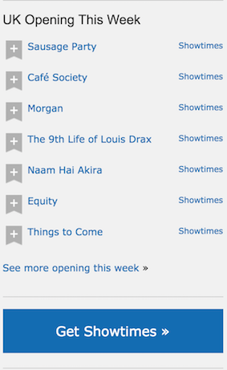

# React IMDB Homework

## How to load the app

Download the repo and enter the following into the console whilst in the root directory:

```
npm install
```

Run the app in development mode (leave running in a terminal window):

```
npm start
```
Open http://localhost:3000 to view it in the browser if it does not automatically open.

## Reading

Thinking In React (20 mins) https://facebook.github.io/react/docs/thinking-in-react.html

## Practice

Here's a component from IMDB showing opening movies this week.

- Draw out the skeleton of this app on paper.
- Write down the names of the components and whether they have state or props.

For example:
- CommentBox - State:comments
  - CommentList Props:comments
    - Comment Props:comment
    - Comment Props:comment
    - Comment Props:comment



Once you've sketched this out, implement the IMDB component in React.
